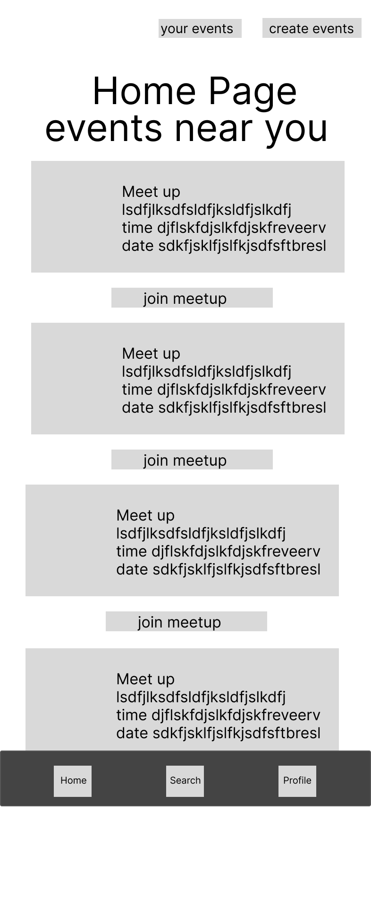
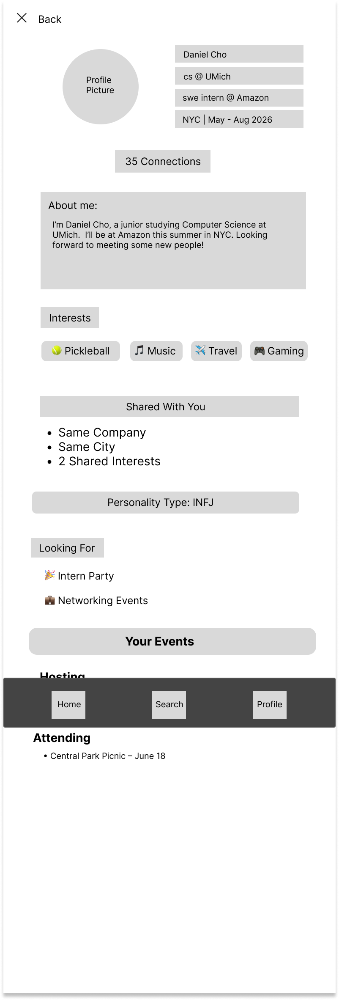
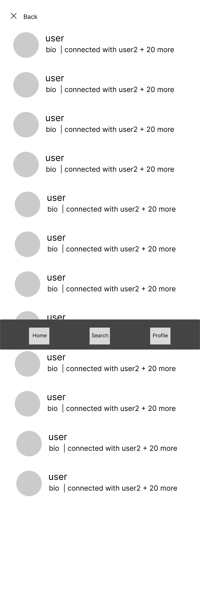
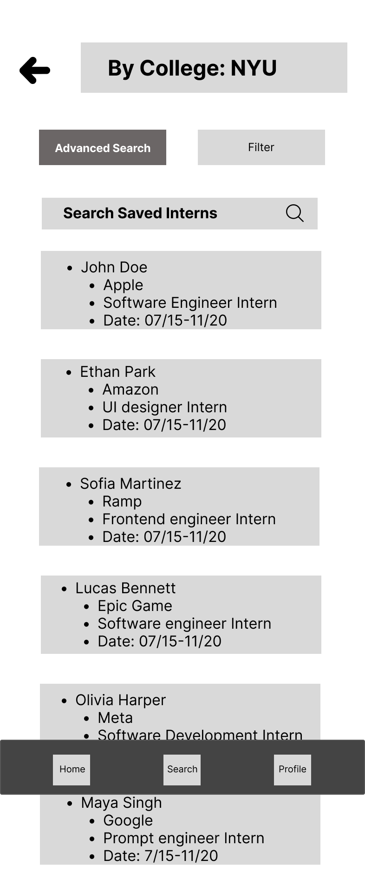

# UX Design Documentation

This document includes the app map and wireframe diagrams for InternBuddy.

---

# App Map

## Overall Application Structure

The app map shows the overall structure of the application, including:
- Authentication flow
- Main navigation tabs
- Profile relationships
- Filtering and search pathways

# Wireframes

## 1. Home Feed Screen

### Purpose
This is the main landing screen after login.

### Key Functionality
- View events near you
- Add events near you

## 2. Profile Screen

### Purpose
Displays a user's internship details and background.

### Key Functionality
- Edit profile
- View shared school/company
- Connect with another intern
- View internship dates

## 3. Search & Filter Screen

### Purpose
Allows users to filter interns by school, company, location, and role.

### Key Functionality
- Multi-select filters
- Apply and reset filters
- Sort results

## 4. Recommendations

### Purpose
Recommends potential connections to users based on school, company, location, and role.

### Key Functionality
- View recommended profiles

## Prototype:

Link to prototype: [InternBuddy](https://www.figma.com/design/70c3FtpyYMZmXRAELl1Gj0/internbuddy?node-id=0-70&t=O0R0NT4ET6CvezY6-0)

